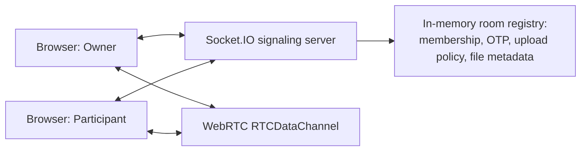

# warp

A browser-based, peer-to-peer file sharing app. Create a room, share a 6-character code plus a 6-digit PIN (or just a QR code), and files move directly between browsers over WebRTC — the server never sees the file bytes, only room membership and connection signaling.

## Description

`warp` is a room-based file-sharing tool. One person creates a room (the **owner**); anyone with the room code and PIN can join as a **participant**. By default only the owner can add files, but a room can be switched to "anyone can send files" so every participant can share into the same room — every file in the list shows who sent it. Once a file is requested, sender and receiver negotiate a direct `RTCPeerConnection`/`RTCDataChannel` and the bytes flow browser-to-browser in 64 KB chunks; the backend's only job is coordinating room membership and relaying the WebRTC handshake (offer/answer/ICE candidates).

## Features

**Rooms & access**
- Short, human-friendly 6-character room codes (unambiguous alphabet — no `0`/`O`, `1`/`I`/`L` confusion)
- 6-digit PIN required to join, kept separate from the shareable link; 5 wrong attempts locks that client out for 60 seconds
- QR code for the invite link, plus a one-tap Share button (native share sheet on mobile, clipboard copy on desktop)
- Per-IP rate limiting on room creation and join attempts
- Idle rooms (30 minutes with no activity) close automatically
- **Owner reconnect grace period**: if the owner's connection drops (phone backgrounded, WiFi blip), the room stays open for 45 seconds and their browser silently reclaims it via a secret token when it reconnects — everyone else just sees a brief "reconnecting" banner instead of the room dying
- Explicit **Leave Room** (participant) and **Close Room** (owner, with a confirmation dialog) controls
- Whenever a room actually closes, everyone is redirected home with a reason-specific "disconnected" notice, instead of being left on a dead screen

**Sharing & transfers**
- Toggle who can add files: **owner only** (default) or **anyone in the room**
- Every file shows who sent it ("sent by you" / "from Alice"); a non-owner's files disappear the instant they leave the room, so nobody's left with a dead "Receive" button
- Multi-file and whole-folder uploads (drag-and-drop or a folder picker)
- Chunked WebRTC transfer with backpressure handling (`bufferedAmount`-aware throttling)
- Per-transfer live status (`connecting → negotiating → transferring → complete/failed/cancelled`) with a one-click retry on failure
- Live throughput and ETA, refreshed every ~2.5s so the numbers are readable instead of flickering
- Aggregate progress bar when several transfers are running at once
- Pause, resume, and cancel a transfer mid-flight, from either side
- No server-side file storage, ever — files never leave the two participating browsers

**Reliability & mobile**
- A dropped mobile tab reconnects automatically the moment it's foregrounded again, instead of sitting invisibly disconnected
- Responsive layout with no horizontal-scroll/overflow issues on small screens

## Architecture Overview



The backend is intentionally thin: it tracks who's in each room, validates the PIN, relays WebRTC offer/answer/ICE messages between whichever two browsers are negotiating a transfer, and keeps a small in-memory record of file metadata (name/size/type/uploader) so everyone in the room knows what's available. The actual file bytes never pass through it — every transfer is a direct `RTCPeerConnection` between the sender's and receiver's browsers.

In production this repo deploys as **one service**: the Express backend serves the built React frontend as static files *and* handles Socket.IO on the same port, so there's a single URL and no cross-origin configuration required.

## Technology Stack

**Frontend**
- React 18 + React Router 6
- Vite 5, Tailwind CSS 3
- `socket.io-client` for signaling
- `qrcode` for the invite QR code
- `lucide-react` icons
- Browser WebRTC APIs (`RTCPeerConnection`, `RTCDataChannel`)

**Backend**
- Node.js + Express 5
- Socket.IO 4 (signaling transport)
- `zod` for validating every inbound socket payload
- `uuid` for file IDs, Node's built-in `crypto` for room codes/PINs/owner tokens
- `dotenv` for local env var loading
- A small hand-rolled in-memory rate limiter (Socket.IO events aren't covered by typical HTTP-only rate limiters)

## Folder Structure

```text
package.json           # root scripts: `npm run build` / `npm start` build+run the whole app as one service
render.yaml             # one-click Render deployment config

backend/
  .env.example
  src/
    server.js           # Socket.IO signaling + (in production) serves frontend/dist
    room.js              # in-memory room registry: membership, OTP, upload policy, file metadata
    schemas.js            # zod validation schema for every socket event
    rateLimiter.js         # per-IP token-bucket limiter for create-room/join-room

frontend/
  .env.example
  src/
    App.jsx              # route table: / , /send/:roomId , /room/:roomId
    pages/
      Home.jsx             # create/join UI, "disconnected" popup
      SenderRoom.jsx        # owner's room view (also downloads others' files when policy allows)
      ReceiverRoom.jsx       # participant's room view (also uploads when policy allows)
    hooks/
      useWebRTC.js           # low-level sender/receiver WebRTC + speed/ETA tracking
      useUploader.js           # "I'm hosting a file" — wraps the sender side per participant
      useDownloader.js          # "I'm receiving a file" — wraps the receiver side per participant
      useVisibilityReconnect.js  # forces a reconnect attempt when a backgrounded tab resumes
    components/
      PayloadList.jsx          # shared file-list rendering (own uploads vs. others' files)
      Modal.jsx
    lib/
      socket.js               # Socket.IO client singleton
      utils.js                  # byte/speed/duration formatting helpers
```

## Prerequisites

- Node.js 18+
- npm
- A browser that supports WebRTC
- Owner and participants must each be able to reach the signaling server, and their networks must allow a direct WebRTC connection (STUN-only — see Known Limitations)

## Environment Variables

Copy each `.env.example` to `.env` and adjust as needed.

**`backend/.env`**
| Variable | Default | Purpose |
|---|---|---|
| `FRONTEND_URL` | `http://localhost:5173` | Origin(s) allowed to talk to the backend, comma-separated if more than one. Only matters for cross-origin setups (local split-dev, or a frontend hosted separately from this backend) — ignored by the browser entirely when this backend serves its own frontend build. |
| `PORT` | `3000` | Port the server listens on. Hosting platforms like Render set this automatically. |

**`frontend/.env`**
| Variable | Default | Purpose |
|---|---|---|
| `VITE_SERVER_URL` | *(unset)* | Only needed for local split-dev (Vite on `:5173` calling a separately-running backend on `:3000`). Leave unset in production — the backend serves this app itself, so the client connects to whatever origin the page was loaded from. |

## Installation

From the repository root:

```bash
npm run build
```

This installs both `backend/` and `frontend/` dependencies and builds the frontend (`frontend/dist`). For day-to-day development you'll usually install each side separately instead — see Running Locally.

## Running Locally

**Split dev (hot-reload, recommended while developing)** — frontend and backend run as separate processes on separate ports, talking cross-origin:

```bash
cd backend && npm install && npm run dev     # signaling server on :3000
cd frontend && npm install && npm run dev    # Vite dev server on :5173
```

Open `http://localhost:5173`. `frontend/.env`'s `VITE_SERVER_URL` points it at the backend.

**Single service (matches production)** — build the frontend once, then have the backend serve it:

```bash
npm run build   # from the repo root
npm start       # from the repo root — serves the built frontend + Socket.IO on one port
```

Open `http://localhost:3000` — everything (UI + signaling) comes from that one origin.

## Build Instructions

```bash
npm run build   # from the repo root — builds frontend/dist
```

## Deployment

This app deploys as a **single service**: the Express backend serves the built React frontend as static files and handles Socket.IO signaling on the same port, so there's only one URL and no cross-origin configuration to get right. The shareable room link is derived from whatever URL the browser actually loaded the app from, so no URL needs to be configured ahead of time.

**Render** (recommended — supports the always-on Node process this app needs):

1. Push this repo to GitHub.
2. In Render, "New +" → "Blueprint", point it at the repo — `render.yaml` at the root configures the service (build command `npm run build`, start command `npm start`) automatically. Or create a Web Service manually with those same two commands.
3. Deploy. No env vars are required for a single-service deployment.

Railway or Fly.io work the same way (same build/start commands); a plain VPS works too (`npm run build && npm start`, kept alive with something like `pm2` or a systemd unit).

**Why not Vercel:** Vercel's serverless functions are stateless and short-lived — they don't hold the persistent process this app needs. The backend keeps rooms in an in-memory `Map` and relies on long-lived Socket.IO connections (WebSocket, with HTTP long-polling fallback); both break under Vercel's serverless model (state resets between invocations, and the WebSocket/polling handshake isn't reliably supported). Vercel is a fine place to host *just* the static frontend build if you want to split the deployment — set `FRONTEND_URL` on the backend to that Vercel URL and `VITE_SERVER_URL` on the frontend to the backend's URL — but the backend itself needs a host with a real persistent process.

## Usage Walkthrough

### Create a room
1. Open the app, click **Create Room**, enter a display name.
2. You land on the room screen with a 6-character **room code**, a 6-digit **PIN**, a QR code, and a **Share Room** button (native share sheet or clipboard copy — includes both the link and the PIN).
3. Optionally switch **Who can send files** to "Anyone in the room" if you want participants to be able to add files too.

### Join a room
1. Open the app, click **Join Room**.
2. Enter a display name, the room code (or paste the full link), and the PIN.
3. You're in — you'll see whatever files have already been added, live, as more get added.

### Send / receive files
1. Whoever is allowed to upload (the owner, or anyone if the policy allows) drags files/folders into the drop zone.
2. Every participant sees the new files immediately, tagged with who sent them.
3. Clicking **Receive** on a file starts a direct WebRTC transfer straight from the uploader's browser — live progress, speed, and ETA update as it downloads. Uploads can be paused, resumed, or cancelled from the sender's side; downloads can be cancelled or retried from the receiver's side.

### Leaving
- A participant can click **Leave** at any time — the owner and everyone else is notified immediately, and that participant's own uploaded files are removed from the room.
- The owner can click **Close Room** (with a confirmation) to end the session for everyone, who are all redirected home with a notice.

## Socket.IO API (the app's protocol — no REST endpoints)

### Client → Server
| Event | Payload |
|---|---|
| `create-room` | `{ name }` |
| `join-room` | `{ roomId, name, otp }` |
| `reclaim-room` | `{ roomId, ownerToken }` — owner reconnecting after a drop |
| `set-upload-policy` | `{ roomId, policy }` — `policy` is `"owner-only"` or `"anyone"`; owner-only action |
| `close-room` | `{ roomId }` — owner-only |
| `leave-room` | `{ roomId }` |
| `file-metadata` | `{ roomId, files: [{ name, size, type }] }` |
| `request-file` | `{ roomId, fileId }` |
| `cancel-transfer` | `{ roomId, fileId }` |
| `webrtc-offer` / `webrtc-answer` / `ice-candidate` | `{ targetSocketId, fileId, offer/answer/candidate }` |

### Server → Client
| Event | Payload |
|---|---|
| `room-created` | `{ roomId, roomLink, otp, ownerToken, uploadPolicy }` |
| `joined-room` | `{ ownerName, ownerSocketId, metadata, uploadPolicy, receivers }` |
| `room-reclaimed` | `{ roomId, metadata, receivers, uploadPolicy }` |
| `reclaim-failed` | error message string |
| `room-error` | error message string |
| `upload-policy-changed` | `{ policy }` |
| `receiver-joined` / `receiver-left` | `{ socketId, name? }` |
| `owner-disconnected` / `owner-reconnected` | *(none)* / `{ ownerSocketId }` |
| `room-closed` | `{ reason }` — `"owner-closed"`, `"sender-disconnected"`, or `"idle-timeout"` |
| `new-files` | `[{ fileId, name, size, type, uploadedAt, senderSocketId, senderName }]` |
| `files-removed` | `{ fileIds }` — that uploader left/disconnected |
| `metadata-ack` | ack of your own `file-metadata` call, same shape as `new-files` |
| `file-requested` | `{ fileId, receiverSocketId }` — sent to whoever is hosting the file |
| `cancel-transfer` | `{ fileId, receiverSocketId }` |
| `webrtc-offer` / `webrtc-answer` / `ice-candidate` | `{ fileId, offer/answer/candidate, senderSocketId/receiverSocketId }` |

## Data Model (in-memory only — no database)

**Room**
```js
{
  roomId,          // 6-char code, also the Socket.IO room name
  otp,             // 6-digit PIN required to join
  owner: { socketId, name },
  ownerToken,      // secret used to reclaim the room after a reconnect
  ownerConnected,  // false during the reconnect grace window
  receivers: [{ socketId, name }],
  uploadPolicy,    // "owner-only" | "anyone"
  metadata: [ FileMetadata ],
  createdAt, lastActivity
}
```

**FileMetadata**
```js
{ fileId, name, size, type, uploadedAt, senderSocketId, senderName }
```

A room's entire state lives in a single process-local `Map` — restarting the backend drops every room.

## Known Limitations

- **No persistence** — all state is in-memory; a server restart or the idle-timeout sweep wipes rooms.
- **No account system** — a room is only as private as its code + PIN combination.
- **No TURN server** — only STUN is configured for ICE, so a direct connection can fail behind symmetric NATs or restrictive corporate firewalls with no fallback relay.
- **A regular participant's uploads don't survive their own disconnect** — unlike the owner (who gets a 45s reconnect grace period via a secret token), a non-owner who drops loses their uploaded files immediately; this is a deliberate scope cut, not a bug, since there's no way to verify a reconnecting participant's identity without a similar token mechanism.
- **No file-integrity verification** — WebRTC's DataChannel is reliable and ordered by default, but there's no application-level checksum comparing the sent and received file.

## Contributors

* Abhinay Ragam
* Hrushikesh Musaloj
* Jayasai Badigeru
* TL: Avinav Mendu

## License

No LICENSE file is present in this repository.
